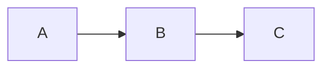
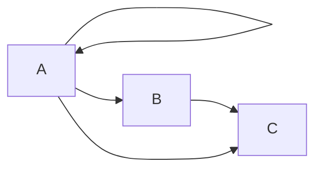

<picture>
<source media="(prefers-color-scheme: dark)" srcset="https://github.com/neuromorphs/NIR/raw/main/docs/logo_dark.png">

</picture>

# NIR: Neuromorphic Intermediate Representation

NIR provides a standard way to describe arbitrary **physical** networks.
**NIR is currently supported by 6 simulators and 4 hardware platforms**, allowing users to seamlessly move between any of these platforms.

Neuron models in NIR are defined as dynamical system equations, because time is an essential component of neuromorphic systems.

The goal of NIR is to provide a common format that different neuromorphic frameworks (including spiking neural networks) can convert to and from.

## Computational primitives
> Read more about in our [documentation about NIR primitives](https://nnir.readthedocs.io/en/latest/primitives.html)

On top of popular primitives such as convolutional or fully connected/linear computations, we define additional compuational primitives that are specific to neuromorphic computing and hardware implementations thereof. 
Computational units that are not specifically neuromorphic take inspiration from the Pytorch ecosystem in terms of naming and parameters (such as Conv2d that uses groups/strides).

## Connectivity 
Each computational unit is a node in a static graph.
Given 3 nodes $A$ which is a LIF node, $B$ which is a Linear node and $C$ which is another LIF node, we can define edges in the graph such as:



Or more complicated graphs, such as



## Format
The intermediate represenation can be stored as hdf5 file, which benefits from compression. 

## Frameworks that currently support NIR

| **Framework** | **Write to NIR** | **Read from NIR** | **Examples** |
| --------------- | :--: | :--: | :------: |
| [Lava-DL](https://github.com/lava-nc/lava-dl) | ✓ | ⬚ |
| [Nengo](https://nengo.ai) | ✓ | ✓ | [Nengo examples](https://github.com/neuromorphs/nir/tree/main/example/nengo/) |
| [Norse](https://github.com/norse/norse) | ✓ | ✓ | [Norse examples](https://github.com/neuromorphs/nir/tree/main/example/norse/) |
| [Rockpool](https://rockpool.ai) ([SynSense Xylo chip](https://www.synsense.ai/products/xylo/)) | ✓ | ✓ |
| [Sinabs](https://sinabs.readthedocs.io) ([SynSense Speck chip](https://www.synsense.ai/products/speck-2/)) | ✓ | ✓ |
| [snnTorch](https://github.com/jeshraghian/snntorch/) | ✓ | ⬚ |
| [SpiNNaker2](https://spinncloud.com/portfolio/spinnaker2/) | ⬚ | ✓ |


## Acknowledgements
Authors (in alphabetical order):
* [Steven Abreu](https://github.com/stevenabreu7)
* [Felix Bauer](https://github.com/bauerfe)
* [Jason Eshraghian](https://github.com/jeshraghian)
* [Matthias Jobst](https://github.com/matjobst)
* [Gregor Lenz](https://github.com/biphasic)
* [Jens Egholm Pedersen](https://github.com/jegp)
* [Sadique Sheik](https://github.com/sheiksadique)
* [Peng Zhou](https://github.com/pengzhouzp)

If you use NIR in your work, please cite the [following Zenodo reference](https://zenodo.org/record/8105042)

```
@software{nir2023,
  author       = {Abreu, Steven and
                  Bauer, Felix and
                  Eshraghian, Jason and
                  Jobst, Matthias and
                  Lenz, Gregor and
                  Pedersen, Jens Egholm and
                  Sheik, Sadique},
  title        = {Neuromorphic Intermediate Representation},
  month        = jul,
  year         = 2023,
  publisher    = {Zenodo},
  version      = {0.0.1},
  doi          = {10.5281/zenodo.8105042},
  url          = {https://doi.org/10.5281/zenodo.8105042}
}
```
