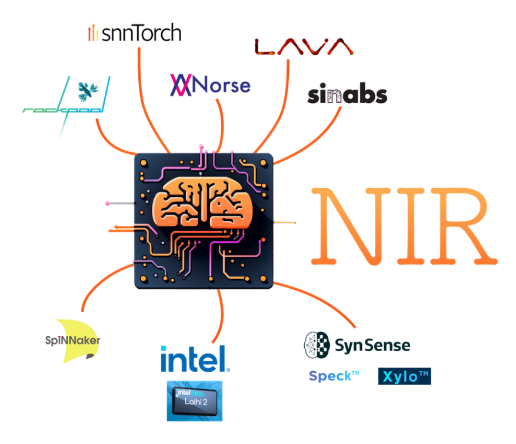

# How to use NIR

NIR itself is a standard: a way to formalize physical neural networks so they are completely unambiguous.
The unambiguous part is crucial because anyone who reads or writes to NIR cannot be confused about what the network does and does not do.

As a user, you rarely need to understand what's inside NIR.
Rather, you would use NIR as a middleman between, say, a neuron simulator and some piece of [neuromorphic](https://en.wikipedia.org/wiki/Neuromorphic_engineering) hardware such as [SynSense's Speck chip](https://www.synsense.ai/products/speck-2/) or [Intel's Loihi platform](https://www.intel.com/content/www/us/en/newsroom/news/intel-unveils-neuromorphic-loihi-2-lava-software.html).



Below, we listed a few concrete examples on how to use NIR.
Please refer to the **Examples** section in the sidebar for code for each supported platform.
More code examples are available [in the repository for our paper](https://github.com/neuromorphs/NIR/tree/main/paper/).

## Example: Norse model to Sinabs Speck

### Part 1: Convert Norse model to NIR
```python
import torch
import norse.torch as norse

# Define our neural network model
model = norse.SequentialState(
  norse.LIFCell(),
  ...
)
# Convert model to NIR
#   Note that we use some sample data to "trace" the graph in PyTorch.
#   You need to ensure that shape of the data fits your model
batch_size = 1
sample_data = torch.randn(batch_size, 10)
nir_model = norse.to_nir(model, sample_data)
```

### Part 2: Convert NIR model to 
```python
import sinabs
from sinabs.backend.dynapcnn import DynapcnnNetwork

# Convert NIR model to Sinabs
sinabs.from_nir(nir_model, batch_size=batch_size)
# Convert Sinabsmodel to chip-supported CNN
dynapcnn_model = DynapcnnNetwork(sinabs_model, input_shape=sample_data.shape[-1])
# Move model to chip!
dynapcnn_model.to("speck2fdevkit")
```
