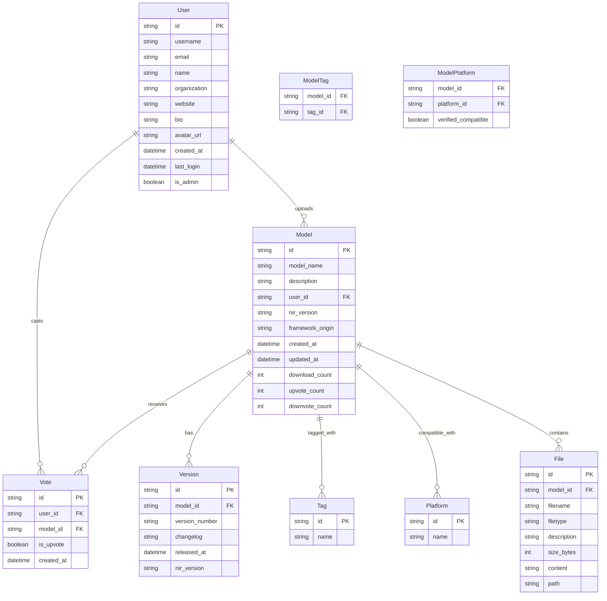

# NIR Hub Database Specification

This document outlines the database schema for the Neural Interchange Representation (NIR) Hub, which serves as a platform for sharing and discovering neural network models in the NIR format.

## Entity Relationship Diagram



## Data Tables

### Users Table

| Field | Type | Description | Constraints |
|-------|------|-------------|-------------|
| id | String | Unique identifier | Primary Key |
| username | String | User's unique username | Unique, Not Null |
| email | String | User's email address | Unique, Not Null |
| name | String | User's full name | |
| organization | String | User's organization/institution | |
| website | String | User's website URL | |
| bio | String | Short user biography | |
| avatar_url | String | URL to profile image | |
| created_at | DateTime | Account creation timestamp | Not Null |
| last_login | DateTime | Last login timestamp | |
| is_admin | Boolean | Admin privileges flag | Default: false |

### Models Table

| Field | Type | Description | Constraints |
|-------|------|-------------|-------------|
| id | String | Unique identifier | Primary Key |
| model_name | String | Model name | Not Null |
| description | String | Detailed description | |
| user_id | String | ID of uploader | Foreign Key |
| nir_version | String | NIR version compatibility | Not Null |
| framework_origin | String | Original framework | |
| created_at | DateTime | Creation timestamp | Not Null |
| updated_at | DateTime | Last update timestamp | Not Null |
| download_count | Integer | Number of downloads | Default: 0 |
| avg_rating | Float | Average rating score | |

### Versions Table

| Field | Type | Description | Constraints |
|-------|------|-------------|-------------|
| id | String | Unique identifier | Primary Key |
| model_id | String | Associated model | Foreign Key |
| version_number | String | Semantic version number | Not Null |
| changelog | String | Version changes | |
| released_at | DateTime | Release timestamp | Not Null |
| nir_version | String | NIR version for this version | Not Null |

### Files Table

| Field | Type | Description | Constraints |
|-------|------|-------------|-------------|
| id | String | Unique identifier | Primary Key |
| model_id | String | Associated model | Foreign Key |
| filename | String | File name | Not Null |
| filetype | String | Type of file (NIR Model, Documentation, etc.) | Not Null |
| description | String | File description | |
| size_bytes | Integer | Size in bytes | |
| content | String | Content for text files | |
| path | String | File storage path | |

### Votes Table

| Field | Type | Description | Constraints |
|-------|------|-------------|-------------|
| id | String | Unique identifier | Primary Key |
| user_id | String | User who voted | Foreign Key |
| model_id | String | Model being voted on | Foreign Key |
| is_upvote | Boolean | True for upvote, False for downvote | Not Null |
| created_at | DateTime | Vote timestamp | Not Null |

### Tags Table

| Field | Type | Description | Constraints |
|-------|------|-------------|-------------|
| id | String | Unique identifier | Primary Key |
| name | String | Tag name | Unique, Not Null |

### ModelTags Table (Junction)

| Field | Type | Description | Constraints |
|-------|------|-------------|-------------|
| model_id | String | Model reference | Foreign Key |
| tag_id | String | Tag reference | Foreign Key |
| PRIMARY KEY | | | (model_id, tag_id) |

### Platforms Table

| Field | Type | Description | Constraints |
|-------|------|-------------|-------------|
| id | String | Unique identifier | Primary Key |
| name | String | Platform name | Unique, Not Null |

### ModelPlatforms Table (Junction)

| Field | Type | Description | Constraints |
|-------|------|-------------|-------------|
| model_id | String | Model reference | Foreign Key |
| platform_id | String | Platform reference | Foreign Key |
| verified_compatible | Boolean | Compatibility flag | Default: false |
| PRIMARY KEY | | | (model_id, platform_id) |

## JSON Schema Examples

### User Document Example

```json
{
  "id": "user123",
  "username": "neuroresearcher",
  "email": "researcher@university.edu",
  "name": "Neural Interface Representation",
  "organization": "NIR Project",
  "website": "https://neuroir.org",
  "bio": "Official account for the Neural Interface Representation (NIR) project, an intermediate representation for neuromorphic computing models.",
  "avatar_url": "https://example.com/avatars/researcher.jpg",
  "created_at": "2023-01-15T12:00:00Z",
  "last_login": "2023-04-10T09:15:32Z",
  "is_admin": false,
  "models": ["model1", "model2"]
}
```

### Model Document Example

```json
{
  "id": "cnn-mnist-sinabs",
  "model_name": "CNN MNIST Classifier (Sinabs)",
  "description": "A convolutional neural network for MNIST digit classification, converted to a spiking neural network using the Sinabs framework.",
  "user_id": "NIR",
  "nir_version": "0.1.0",
  "framework_origin": "Sinabs",
  "created_at": "2023-05-22T14:30:45Z",
  "updated_at": "2023-05-22T14:30:45Z",
  "download_count": 127,
  "upvote_count": 42,
  "downvote_count": 3,
  "tags": ["CNN", "MNIST", "classification", "vision", "spiking"],
  "compatible_platforms": [
    {"id": "platform1", "name": "Sinabs", "verified_compatible": true},
    {"id": "platform2", "name": "PyTorch", "verified_compatible": true},
    {"id": "platform3", "name": "Lava", "verified_compatible": true},
    {"id": "platform4", "name": "Loihi", "verified_compatible": false},
    {"id": "platform5", "name": "SpiNNaker2", "verified_compatible": true}
  ],
  "files": [
    {
      "id": "file1",
      "filename": "cnn_sinabs.nir",
      "filetype": "NIR Model",
      "description": "NIR representation of a CNN classifier",
      "size_bytes": 273408,
      "path": "/storage/models/cnn-mnist-sinabs/cnn_sinabs.nir"
    },
    {
      "id": "file2",
      "filename": "README.md",
      "filetype": "Documentation",
      "description": "Documentation for the CNN MNIST classifier",
      "content": "# CNN MNIST Classifier\n\nThis is a convolutional neural network for MNIST digit classification...",
      "size_bytes": 1024
    },
    {
      "id": "file3",
      "filename": "model_config.json",
      "filetype": "Configuration",
      "description": "Configuration file with model parameters",
      "content": "{\n  \"architecture\": \"CNN\",\n  \"input_shape\": [1, 28, 28],\n  \"output_shape\": [10]...",
      "size_bytes": 512
    }
  ]
}
```

## Implementation Considerations

1. **Database Technology**:
   - A document database like MongoDB or Firebase Firestore would work well with the hierarchical data structure of models
   - Alternatively, a relational database like PostgreSQL could be used, especially with JSON columns for flexible schema elements

2. **Storage Strategy**:
   - NIR model files should be stored in a file storage system (local filesystem for development, cloud storage for production)
   - File paths should be stored in the database, with the actual files in storage
   - Small text files (README, configuration) could be stored directly in the database as content fields

3. **API Design**:
   - REST API endpoints should match the current implementation:
     - `/api/models` (GET, POST) - List/create models
     - `/api/models/<id>` (GET, DELETE) - Get/delete model
     - `/api/models/<id>/download` - Download model file (records download count)
     - `/api/models/<id>/upvote` - Upvote a model
     - `/api/models/<id>/downvote` - Downvote a model
     - `/api/models/search` - Search models by criteria

4. **Authorization**:
   - User authentication (likely JWT-based)
   - Role-based permissions (admin, regular user)
   - Model ownership controls (only owners can update/delete)
   - Anonymous download tracking (no login required)
   - Voting requires authentication (prevent duplicate votes)

5. **Versioning**:
   - Version tracking for models to support compatibility checks
   - Major, minor, patch version compatibility rules as documented

6. **Search & Discoverability**:
   - Full-text search for model descriptions
   - Filtering by tags, framework origin, and compatible platforms
   - Sorting by popularity (downloads) and vote counts

## Migration Path

1. **Phase 1**: Set up schema and migrate existing models from current file-based storage
2. **Phase 2**: Implement user authentication and access controls
3. **Phase 3**: Add advanced features (ratings, versioning, analytics)
4. **Phase 4**: Optimize for performance and scale

## Future Extensions

1. **Usage Statistics**: Track detailed model usage and performance metrics
2. **Download Analytics**: Track downloads by region, platform, and framework
3. **Collaboration Features**: Allow multiple contributors to a model
4. **Integration Testing**: Automated compatibility testing with different platforms
5. **Model Collections**: Group related models into collections or projects
6. **Interactive Demos**: Browser-based demos of models using WebGL or WebAssembly
7. **Anonymous Feedback**: Allow anonymous users to provide feedback without voting